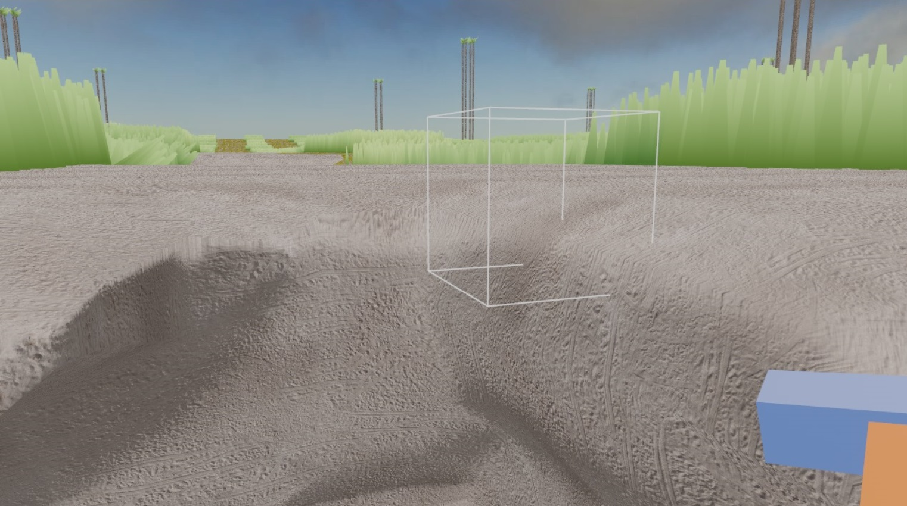

# Drusniel Voxels

## Version History

### V0.3
*   **PBR Materials & Parallax Mapping**: Implemented PBR material blending and parallax occlusion mapping, specifically enhancing rock textures.
*   **Texture Splatting**: Added smooth triplanar material blending (texture splatting) using vertex weights for seamless terrain transitions.
*   **Surface Nets Improvements**: Addressed chunk seams and fixed UV mapping/repeat samplers for surface nets.
*   **Material & Mesh Updates**: Ongoing updates to materials and mesh generation.

*   **Smooth Slope Movement**: Enhanced character controller with bilinear terrain height detection and step-up logic for fluid movement over terrain.

### V0.2
*   **Procedural Generation**: Added procedural grass mesh patches.
*   **Terrain & Environment**: Adjusted terrain balance by reducing sand beach areas; tweaked lighting and reintroduced water rendering.
*   **Assets**: Integrated new texture assets (PNG files).
*   **Rendering**: Improved visual fidelity with lighting adjustments.

### V0.1
*   **Core Systems**: Initial implementation work.
*   **Chunk Rendering**: Fixed visibility issues with chunk boundary faces.
*   **Modesty Fix**: Adjustments for content appropriateness for tilable terrain.

## Controls

### General
*   **Escape**: Toggle Pause Menu / Close Chat
*   **M**: Toggle Map Overlay
*   **Shift + M**: Toggle Edit Mode
*   **G**: Print Debug Voxel Info (Console Log)
*   **F3**: Enter Debug Mode

### Movement
*   **W / A / S / D**: Move Forward, Left, Back, Right
*   **Space**: Jump (Walk Mode) / Fly Up (Fly Mode)
*   **Left Shift**: Sprint (Walk Mode) / Fly Down (Fly Mode)
*   **Left Ctrl**: Turbo Speed (Fly Mode)
*   **Tab**: Toggle Fly/Walk Mode
*   **R**: Reset Position to Spawn

### Interaction
*   **Left Click**: Break Block / Attack Entity
*   **Right Click**: Place Block

### Edit Mode (Toggle with Shift + M)
*   **Left Click + Drag**: Move Block
*   **Q / E** or **Mouse Wheel**: Rotate Dragged Block
*   **Delete**: Toggle Delete Mode
    *   **Left Click**: Delete Block (while in Delete Mode)

### Chat
*   **Ctrl + A**: Open Chat
*   **Enter**: Send Message
