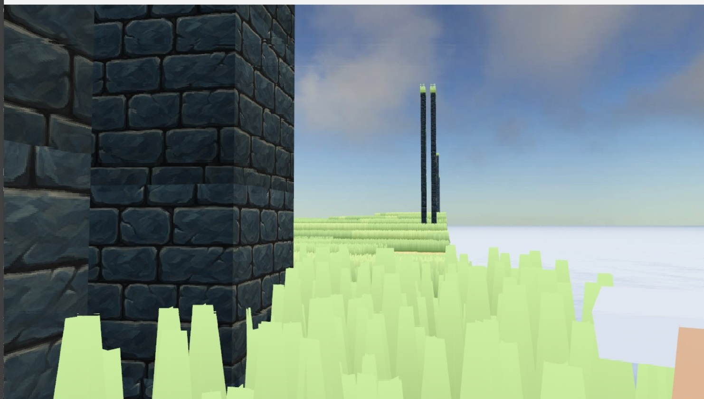

# Drusniel Voxels

Rust voxel game prototype based on the Drusniel world.



## v0.2

This version expands the initial voxel runtime with terrain and rendering polish:

- Procedural grass mesh patches
- Rebalanced terrain generation with reduced sand beach coverage
- Water rendering restored
- Environment lighting adjustments
- Additional runtime texture assets
- Continued chunked voxel world rendering
- Config-driven voxel types and world settings
- Texture atlas rendering

## Setup

Install Rust, then build from the repository root:

```bash
cargo build
```

Run the game:

```bash
cargo run
```

## Project Layout

| Path | Role |
|---|---|
| `src/main.rs` | Runtime entry point |
| `src/lib.rs` | Shared module root |
| `src/camera/` | Camera controller and plugin |
| `src/config/` | YAML config loading |
| `src/environment.rs` | Environment and sky setup |
| `src/rendering/` | Materials, atlas loading, and rendering plugin |
| `src/vegetation/` | Grass material setup |
| `src/voxel/` | Voxel world, chunks, meshing, and types |
| `assets/config/` | World and voxel type settings |
| `assets/models/` | Runtime model assets |
| `assets/shaders/` | WGSL shaders |
| `assets/textures/atlas.png` | Runtime texture atlas |
