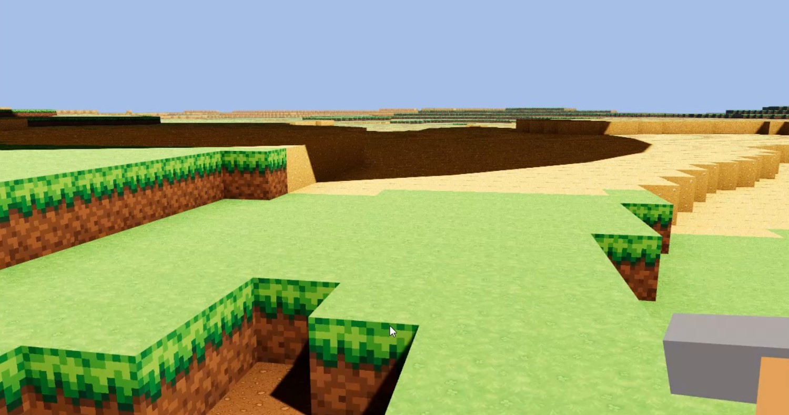

# Drusniel Voxels

Rust voxel game prototype based on the Drusniel world.



## v0.1

This first version contains the initial voxel runtime:

- Chunked voxel world rendering
- Basic camera and player controls
- Config-driven voxel types
- Texture atlas rendering
- Grass material setup
- Chunk boundary visibility fixes
- Tilable terrain texture adjustments

## Setup

Install Rust, then build from the repository root:

```bash
cargo build
```

Run the game:

```bash
cargo run
```

## Project Layout

| Path | Role |
|---|---|
| `src/main.rs` | Runtime entry point |
| `src/lib.rs` | Shared module root |
| `src/camera/` | Camera controller and plugin |
| `src/config/` | YAML config loading |
| `src/rendering/` | Materials, atlas loading, and rendering plugin |
| `src/vegetation/` | Grass material setup |
| `src/voxel/` | Voxel world, chunks, meshing, and types |
| `assets/config/` | World and voxel type settings |
| `assets/shaders/` | WGSL shaders |
| `assets/textures/atlas.png` | Runtime texture atlas |
