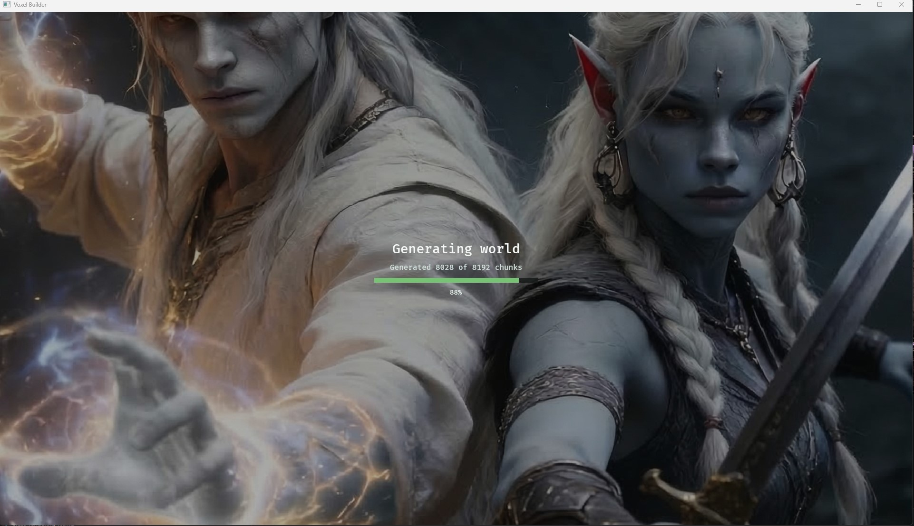
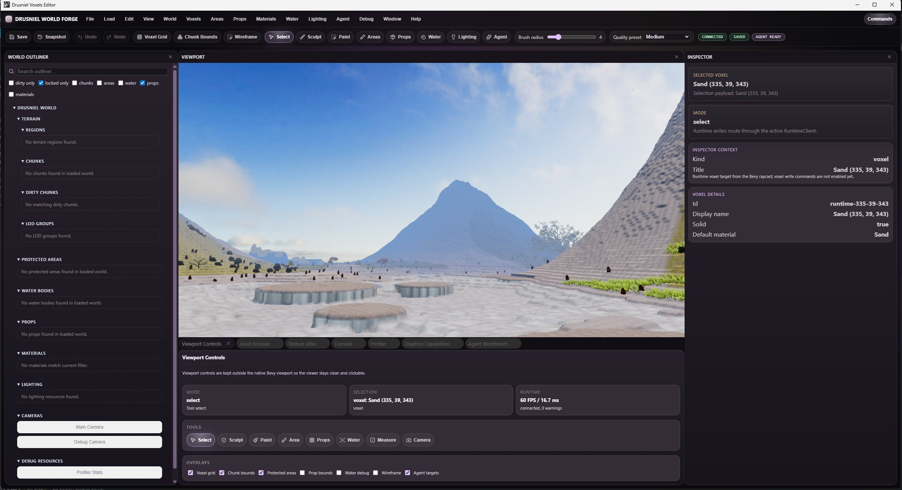

# Drusniel Voxels

Game based on https://www.drusniel.com/ lore.

## Version History

| Version | Summary | Main Image |
| ------- | ------- | ---------- |
| v0.5 | Current development version with water overhaul, NAADF experiments, performance work, collider benches, sounds, fantasy UI, terrain hex-tiling, and the new editor. |  |
| v0.4 | Rendering stack, GI, atmosphere, terrain tools, building systems, props, and persistence. |  |
| v0.3 | PBR materials, triplanar splatting, surface-net fixes, and smoother slope movement. |  |
| v0.2 | Procedural grass, terrain balance, water restoration, texture assets, and rendering polish. |  |
| v0.1 | Initial implementation, chunk rendering fixes, and tilable terrain adjustments. |  |

## Controls

The runtime supports keyboard and mouse movement, terrain debug toggles, camera controls,
digging tools, and editor-facing workflows.

## Profiling

Benchmark scenes are kept under `bench/scenes`. Use the release bench commands for
performance checks before making timing claims.

## Rendering And NAADF

The rendering stack includes terrain, water, lighting, post-processing, and experimental
NAADF paths.

## Free Texture Sources Guide

Runtime texture assets live under `assets/textures` and `assets/pbr`.

## Editor

The desktop editor source is included under `editor`.
